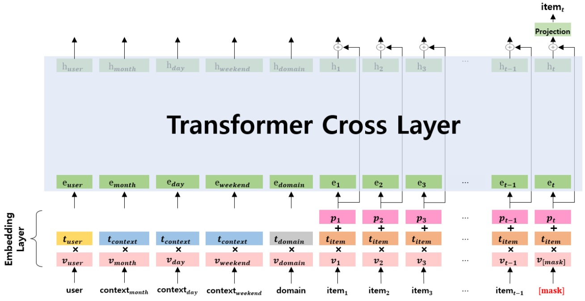

# Context-Aware Residual Transformer (CART)
Context-Aware Residual Transformer (CART) is a kiosk recommendation system (CART) that utilizes self-supervised learning techniques tailored to kiosks in an offline retail environment and developed by a collaboration between [NS Lab, CUK](https://nslab-cuk.github.io/) and [IIP Lab, Gachon](http://iiplab.gachon.ac.kr/)  based on pure [PyTorch](https://github.com/pytorch/pytorch) backend.

<p align=center>
  <a href="https://www.python.org/downloads/release/python-360/">
    =3.8.8-3776AB?logo=python&style=flat-square" alt="Python">
  </a>    
  <a href="https://github.com/pytorch/pytorch">
    =1.4-FF6F00?logo=pytorch&style=flat-square" alt="pytorch">
  </a>    
  
  
  
  
  
  
  
</p>

<br>


## 1. Overview

Over the years, Recommendation systems have been widely employed across diverse tasks to offer hyperpersonalized services considering users’ unique preferences and past behaviors. However, existing recommendation systems may be less suited for edge-computing settings because of their high computational costs and numerous parameters. In this work, we propose a novel kiosk recommendation system (CART) that involves (i) self-supervised learning based on contextual information in offline retail environments and (ii) representation learning of user behaviors based on contextual information. The proposed model uses self-supervised learning to learn user propensity, contextual information, and domain attributes from offline retail. We propose three selfsupervised learning tasks: (i) learning user propensity through transactions, (ii) learning domain characteristics through item purchases, and (iii) learning contextual information through user propensity and behavior. After pre-training with the three tasks, the proposed model was fine-tuned to focus on specific user behaviors based on contextual information. We also evaluated the quality of items recommended by the proposed kiosk recommendation system using the transactions of a real kiosk system. As a result, MAP@3 was improved by 29.1% compared to the existing recommendation system.

<br>

<p align="center">
  
  <br>
  <b></b> The overall architecture of Context-Aware Residual Transformer.
</p>


## 2. Reproducibility

### Datasets 

The package ```dataset``` contains our dataset for the experiments. The dataset contains transactions extracted from a kiosk company
database was used to evaluate the experiment.

### Requirements and Environment Setup

The source code developed in Python 3.9. CART are built using Pytorch_lightning. Please refers to official websites for installation and setup.
All the requirements are included in ```requirements.txt``` file. 

```
# Install python environment

pip install -r requirements.txt

```

### How to run

The source code contains three files, i.e., pre_training, training, and testing files.

```
# Pre-training

python 0.pretrain.py

# Training CART with label

python 1.train.py

# Testing the performance

python 2.test.py
```

## 3. Citing CART

Please cite our [paper](https://ieeexplore.ieee.org/abstract/document/10433857) if you find *CART* useful in your work:
```
@article{jung2024kiosk,
      title     = {Kiosk Recommend System Based On Self-Supervised Representation Learning of User Behaviors in Offline Retail}, 
      author    = {Nam Gyu Jung and Van Thuy Hoang and O-Joun Lee and Chang Choi},
      journal   = {IEEE Internet of Things Journal},
      title     = {Kiosk Recommend System Based On Self-Supervised Representation Learning of User Behaviors in Offline Retail},
      year      = {2024},
      issn      = {2372-2541},
      note      = {To Appear},
      doi       = {10.1109/JIOT.2024.3365144},
      publisher = {Institute of Electrical and Electronics Engineers (IEEE)},
}

```

## Contributors

Contributors: [@Namgyu97](https://github.com/Namgyu97) and [@BWAAEEEK](https://github.com/BWAAEEEK)

<a href="https://github.com/NSLab-CUK/Kiosk-RecSys/graphs/contributors">
  
</a>
